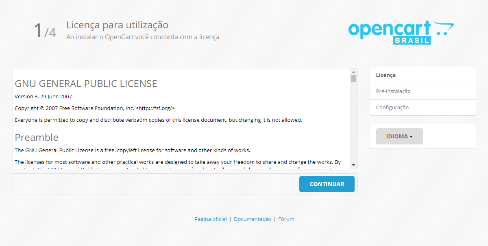
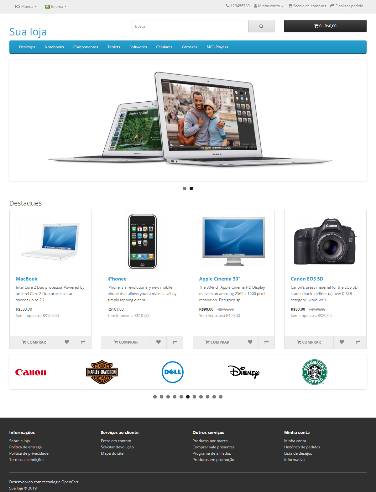

<p align="center"><a href="https://www.opencartbrasil.com.br/"></a>
</p>

<p align="center">
<a href="https://github.com/opencartbrasil/opencartbrasil/releases"></a>
<a href="./CHANGELOG.md"></a>

<a href="./LICENSE"></a>
</p>

### Instalação traduzida:



### Página principal da loja:



### Painel de controle administrativo:


## Apresentação

O projeto OpenCart Brasil é um fork do OpenCart 3, que tem o objetivo de oferecer uma versão do OpenCart otimizada, atualizada e segura, com foco especial no mercado brasileiro, sempre compatível com a última versão estável do OpenCart, e mantendo a licença GPLv3 para garantir que **o projeto OpenCart Brasil é livre e sempre será**.

Aqui você poderá analisar o código, relatar erros e enviar correções ou melhorias para o projeto.

Recomendamos que todos os desenvolvedores sigam este repositório para receberem atualizações sobre o projeto.

## Demonstração

Para acessar uma demonstração online do OpenCart Brasil e visualizar a loja em funcionamento <a href="https://www.opencartbrasil.com.br/test-drive-loja" target="_blank">clique aqui</a>.

## Diferenciais

- Bootstrap 3.3.7 atualizado.
- Suporte para tarefas agendadas.
- Sistema de afiliados 100% funcional.
- Correção de bugs e otimizações no código.
- Campo NCM e CEST nos produtos.
- Campo SKU nas opções dos produtos.
- **Atualização automática do OpenCart Brasil**.
- Melhorias no gerenciamento de sessões.
- Melhorias no gerenciamento de cookies.
- Melhorias no gerenciamento de downloads.
- Melhorias no processo de login dos clientes.
- Melhorias na criptografia das senhas dos clientes.
- Novas extensões do tipo conversor de moedas.
- O processo de instalação ocorre em português do Brasil.
- Ferramenta de instalação por linha de comando em português do Brasil.
- Após a instalação, a loja já estará em português do Brasil com a moeda Real.
- Todos os dados de demonstração e dados auxiliares já estão em português do Brasil.

## Changelog

Para analisar todas as correções, modificações e melhorias realizadas a cada versão lançada <a href="https://github.com/opencartbrasil/opencartbrasil/blob/master/CHANGELOG.md">clique aqui</a>.

## Atualização

Para realizar a atualização automática do OpenCart Brasil, na administração da loja, acesse o menu **Configurações→Manutenção→Atualização**, clique na aba "**Atualizar**", e siga as instruções na página para executar a atualização automática.

**Atenção:** Em casos raros, durante o processo de atualização automática ocorre um erro que não permite o acesso a loja após a substituição dos arquivos da loja, sendo que este é causado pelos seguintes motivos:

- O cache de arquivos criado pelas modificações OCMOD estão causando o problema.
- O tema que foi instalado na loja sobrescreveu arquivos nativos do OpenCart.

Para resolver, apague todos os arquivos (com exceção do arquivo index.html) e as pastas que estão dentro da pasta storage/**modification** (veja o caminho para a pasta storage dentro do arquivo **config.php**), e reenvie os arquivos do tema que você está utilizando na loja (caso esteja utilizando um tema personalizado).

Dependendo da hospedagem (com baixa qualidade), pode ser necessário fazer o download da versão mais recente do OpenCart Brasil, e reenviar todos os arquivos da pasta "**system**", sobrescrevendo os arquivos que já estão lá.

Após executar os procedimentos, acesse a administração da loja e vá no menu **Extensões→Modificações**, clique no botão **Atualizar** para atualizar o cache de modificações, depois vá na página principal do painel de controle da administração da loja, abaixo do botão "**Sair**", você verá um botão na cor azul com o desenho de uma engrenagem branca dentro dele, clique neste botão, e no popup que vai abrir, clique nos dois botões na cor laranja que estão dentro da coluna "**Ação**" para atualizar o cache do tema.

## Roteiro

### Tarefas concluídas:

- [x] Loja 100% traduzida.
- [x] Atualização automática.
- [x] Instalação 100% traduzida.
- [x] Suporte para tarefas agendadas.
- [x] Campo NCM no cadastro do produto.
- [x] Campo CEST no cadastro do produto.
- [x] Campo SKU nas opções dos produtos.
- [x] Novas extensões do tipo conversor de moedas.
- [x] Correção nas sessões.
- [x] Correção nas estátisticas.
- [x] Correção nos arquivos config.
- [x] Correção na API do catálogo.
- [x] Correção na edição de pedidos.
- [x] Correção no sistema de pontos.
- [x] Correção no programa de afiliados.
- [x] Correção no Google Merchant Center.
- [x] Correção nas campanhas de marketing.
- [x] Correção no formulário de contato.
- [x] Correção no formulário de produtos.
- [x] Correção na biblioteca do carrinho.
- [x] Correção no envio de e-mail por SMTP.
- [x] Correção das falhas ao finalizar o pedido.
- [x] Melhorias nos produtos por downloads.
- [x] Melhorias no gerenciamento de sessão.
- [x] Melhorias no startup e framework do core.
- [x] Melhorias na tradução e no layout de e-mail.
- [x] Melhorias na comunicação com o banco de dados.
- [x] Melhorias na criptografia das senhas dos clientes.
- [x] Melhorias na redefinição de senha do cliente na loja.

### Tarefas em andamento:

- [ ] Melhorias na API REST para inclusão de produtos, clientes, pedidos, etc.

### Próximas tarefas:

- [ ] Webhook que enviará notificações para aplicações externas.

## Requisitos

### ⚠ Aviso:

Se o seu serviço de hospedagem não lhe oferece versões atualizadas dos softwares citados abaixo, troque de serviço de hospedagem, pois sua loja não pode ficar exposta por causa das falhas de segurança existentes em softwares antigos.

Se você é o profissional que administra os servidores que armazenam os arquivos e dados da loja, não utilize os softwares descritos abaixo em versões antigas. Utilize as versões mínimas recomendadas, sendo o ideal utilizar as versões mais recentes não só por questões de desempenho, mas principalmente por questão de segurança.

### Servidores web compatíveis:

- Apache 2.4 ou superior.
- Nginx 1.14 ou superior.

### OpenSSL:

- 1.0.1c ou superior.

### cURL:

- 7.34.0 ou superior.

### Bancos de dados compatíveis:

- MySQL 5.5 ou superior (Recomendado 5.7 ou superior).
- MariaDB 5.5 ou superior (Recomendado 10.3 ou superior).

### Versões do PHP compatíveis:

- 5.6 ou superior (recomendado 7.3 ou superior).

### Configurações mínimas necessárias no PHP:

| Diretiva | Valor |
| -------- | ----- |
| `register_globals` | Off |
| `magic_quotes_gpc` | Off |
| `safe_mode` | Off |
| `file_uploads` | On |
| `allow_url_fopen` | On |
| `open_basedir` | none |
| `default_charset` | UTF-8 |
| `max_execution_time` | 360 |
| `upload_max_filesize` | 100M |
| `post_max_size` | 100M |
| `memory_limit` | 128M |
| `session.auto_start` | Off |
| `session.use_only_cookies` | On |
| `session.use_cookies` | On |
| `session.use_trans_sid` | Off |
| `session.cookie_httponly` | On |
| `*session.cookie_secure` | On |
| `session.cache_limiter` | nocache |
| `session.gc_maxlifetime` | 3600 |
| `session.gc_probability` | 1 |
| `session.gc_divisor` | 100 |

**Notas sobre as configurações do PHP:**

Só habilite a diretiva **session.cookie_secure** quando o HTTPS estiver funcionando em todas as páginas da sua loja, caso contrário o usuário não conseguirá logar. Lembrando que toda loja deve utilizar certificado de segurança para conexão segura por HTTPS.

Configure as diretivas **session.gc_probability** e **session.gc_divisor** conforme o número de visitas simultâneas/diárias que a loja recebe, pois elas são as responsáveis pelo momento em que ocorrerá a higienização de sessões expiradas, ou seja, se você configurá-las conforme abaixo:

| Diretiva | Valor |
| -------- | ----- |
| `session.gc_probability` | 1 |
| `session.gc_divisor` | 100 |

Siginifica que "*em média*" a cada **100 visitas**, há **1% de probabilidade** da higienização de sessões expiradas ser executada, o que é mais que suficiente para uma loja de pequeno porte, sendo que você pode configurar higienizações mais agressivas (não recomendado), conforme abaixo:

| Diretiva | Valor |
| -------- | ----- |
| `session.gc_probability` | 1 |
| `session.gc_divisor` | 4 |

Significa que "*em média*" a cada **4 visitas**, há **25% de probabilidade** da higienização de sessões expiradas ser executada.

O importante é **configurar as diretivas com sabedoria**, levando em consideração a análise estatística da quantidade de visitas simultâneas/diárias que a loja recebe, para não executar higienizações desnecessárias ou poucas higienizações, sempre levando em consideração que as configurações devem ser reavaliadas quando houver alterações na quantidade de visitas simultâneas/diárias da loja, ou quando a loja estiver se preperarando para receber um número de visitas acima do rotineiro.

**Importante:** Não esqueça de habilitar as tarefas agendadas, pois elas são complementares na higienização de sessões expiradas (há instruções mais abaixo sobre como habilitar).

### Configurações mínimas recomendadas no MySQL/MariaDB:

| Variável | Valor | Descrição |
| -------- | ----- | --------- |
| `wait_timeout` | 30 | 30 segundos |
| `interactive_timeout` | 30 | 30 segundos |
| `max_allowed_packet` | 16777216 | 16M |

### Extensões básicas necessárias no PHP:

- cURL
- DOM
- Fileinfo
- GD
- MySQLi
- Mbstring
- OpenSSL
- ZLIB
- ZIP
- XML

### ⚠ Notas:

Não é compatível com sistema operacional Windows utilizando servidor web IIS.

Em breve a versão mínima aceita pelo OpenCart será o PHP 7.1 (recomendado PHP 7.3 ou superior), pois o suporte para o PHP até as versões 7.0 encerraram em dezembro de 2018, ou seja, não faz sentido continuar o suporte para versões do PHP que os próprios desenvolvedores abandonaram, o que significa que essas versões não receberão correções de bugs e falhas.

## Download

### Através do site:

Faça o download da última versão estável através de nosso site [clicando aqui](https://www.opencartbrasil.com.br/download).

### Através do repositório:

Faça o download da última versão estável marcada como **latest release** [clicando aqui](https://github.com/opencartbrasil/opencartbrasil/releases/).

### Utilizando o composer:

``
composer create-project opencartbrasil/opencartbrasil nome_da_pasta
``

### Utilizando o Git Bash:

``
git clone https://github.com/opencartbrasil/opencartbrasil.git
``

## Instalação

### ⚠ Preparativos:

1. Crie um banco de dados no MySQL para uso da loja.
2. Crie um usuário no MySQL para uso da loja. **Atenção:** Em produção utilize um usuário exclusivo para a loja.
3. Adicione no usuário as permissões de acesso ao banco de dados da loja.

### Através do navegador (manual):

1. Extraia o conteúdo do arquivo zip que você baixou, no servidor em que você irá instalar o OpenCart Brasil.
2. Renomeie os arquivos **config_dist.php** e admin/**config_dist.php** para **config.php**.
3. Em ambiente Linux, a permissão incial de todos os arquivos deve ser **644** e de todas as pastas **755**.
4. Através do navegador, acesse o domínio onde estão os arquivos do OpenCart Brasil para iniciar a instalação.
5. Ao final da instalação a loja estará pronta para utilização.

### Através da Interface CLI (automática):

Através da interface de linha de comandos, a loja pode ser instalada automaticamente.

1. Extraia o conteúdo do arquivo zip que você baixou, no servidor em que você irá instalar o OpenCart Brasil.
2. No diretório raiz onde estão os arquivos do OpenCart Brasil, execute a linha de comando para iniciar a instalação.
3. Ao final da instalação a loja estará pronta para utilização.

**Exemplo de instalação através da linha de comando no servidor local:**

``
php install/cli_install.php install --db_hostname localhost --db_username root --db_password 123456 --db_database opencartbrasil --username admin --password 123456 --email usuario@dominio.com.br --http_server http://localhost/opencartbrasil/
``

Lista de parâmetros para instalação através da linha de comando:

| Parâmetro | Descrição | Padrão | Obrigatório |
| --------- | --------- | ------ | ----------- |
| `db_driver` | Driver para conexão com o banco de dados. | mysqli | Não |
| `db_hostname` | Nome do servidor de banco de dados. | localhost | Não |
| `db_username` | Usuário com permissão para o banco de dados. | | Sim |
| `db_password` | Senha do usuário com permissão para o banco de dados. | | Sim |
| `db_database` | Nome do banco de dados para instalar as tabelas da loja. | | Sim |
| `db_port` | Porta para acesso ao banco de dados MySQL. | 3306 | Não |
| `db_prefix` | Prefixo adicionado nas tabelas criadas no banco de dados. | oc_ | Não |
| `username` | Usuário administrador da loja que será cadastrado durante a instalação. | admin | Não |
| `password` | Senha do usuário administrador da loja. | | Sim |
| `email` | E-mail do usuário administrador da loja. | | Sim |
| `http_server` | Domínio da loja com uma / (barra) no final. | | Sim |

## Configurações adicionais

### Habilitar as tarefas agendadas (obrigatório):

A execução das tarefas agendadas são essenciais para o funcionamento do OpenCart Brasil, sendo que a execução das tarefas agendadas não sobrecarrega a navegação da loja, pois elas ocorrem em segundo plano.

Atualmente as seguintes tarefas estão agendadas para serem executadas no OpenCart Brasil:

- Higienizar as sessões expiradas uma vez ao dia.
- Atualizar a cotação das moedas uma vez ao dia.

Para executar as tarefas agendadas do OpenCart Brasil, você necessitará acessar através da administração da loja o menu **Extensões→Tarefas agendadas**, copiar a linha que está no campo **Comando**, e adicioná-la para ser executada a cada 1 (uma) hora no Agendador de Tarefas (Cronjobs ou Tarefas Cron) de sua hospedagem.

**Importante:** Se você nunca utilizou o Agendador de Tarefas de sua hospedagem, solicite ajuda ao suporte de sua hospedagem para saber como utilizá-lo.

### Habilitar URL amigável em servidor web Nginx (opcional):

Adicione no arquivo **nginx.conf** dentro do bloco "**location / { }**":

```
  location ~ (?i)((\.twig|\.tpl|\.ini|\.log|(?<!robots)\.txt)) { deny all; }

  rewrite ^/sitemap.xml$ /index.php?route=extension/feed/google_sitemap last;
  rewrite ^/googlebase.xml$ /index.php?route=extension/feed/google_base last;
  rewrite ^/system/storage/(.*) /index.php?route=error/not_found last;

  if (!-f $request_filename) { set $rule_0 1$rule_0; }
  if (!-d $request_filename){ set $rule_0 2$rule_0; }
  if ($uri !~ ".*.(ico|gif|jpg|jpeg|png|js|css)"){ set $rule_0 3$rule_0; }
  if ($rule_0 = "321"){ rewrite ^/([^?]*) /index.php?_route_=$1 last; }
```

## Versionamento

Para o controle de versões utilizamos as especificações de [Versionamento Semântico](https://semver.org/lang/pt-BR/spec/v2.0.0.html)

## Suporte

Este repositório não é adequado para fornecer suporte sobre a utilização do projeto OpenCart Brasil.

Só registre uma Issue para relatar erros no núcleo do projeto OpenCart Brasil.

Para suporte relacionado sobre a utilização do projeto OpenCart Brasil, utilize o nosso fórum:

https://forum.opencartbrasil.com.br/

## Contribuindo

Se você encontrou um erro no núcleo do projeto OpenCart Brasil e deseja nos relatar, você deve registrar uma Issue.

Se você tem uma correção ou melhoria e deseja nos enviar, faça um fork e nos envie um Pull request para avaliarmos.

## Vulnerabilidades

Se você descobrir uma vulnerabilidade de segurança no projeto OpenCart Brasil, envie um e-mail para [dev@opencartbrasil.com.br](mailto:dev@opencartbrasil.com.br). Todas as vulnerabilidades informadas serão imediatamente tratadas caso confirmadas.

## Licença

O projeto OpenCart Brasil é um software de código aberto licenciado sob a [GPL v3](./LICENSE).
